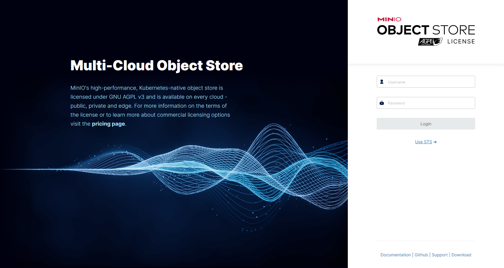

# Setup guide: MinIO S3 setup

## Section 1 — Installing and configuring the MinIO server

Update packages and download the MinIO binary:

```bash
sudo apt update
wget https://dl.min.io/server/minio/release/linux-amd64/minio
```

Install the binary and set up the MinIO user:

```bash
sudo chmod +x minio
sudo mv minio /usr/local/bin
sudo useradd -r minio-user -s /sbin/nologin
sudo chown minio-user:minio-user /usr/local/bin/minio
sudo mkdir /usr/local/share/minio
sudo chown minio-user:minio-user /usr/local/share/minio
sudo mkdir /etc/minio
sudo chown minio-user:minio-user /etc/minio
```

Create the environment configuration file `/etc/default/minio`:

```ini
MINIO_ACCESS_KEY="minio"
MINIO_VOLUMES="/usr/local/share/minio/"
MINIO_OPTS="-C /etc/minio --address :9000 --console-address :9001"
MINIO_SECRET_KEY="miniostorage"
```

---

## Section 2 — Installing the Systemd MinIO startup script

Create the service file `/etc/systemd/system/minio.service`:

```ini
[Unit]
Description=MinIO
Documentation=https://docs.min.io
Wants=network-online.target
After=network-online.target
AssertFileIsExecutable=/usr/local/bin/minio

[Service]
WorkingDirectory=/usr/local/

User=minio-user
Group=minio-user

EnvironmentFile=/etc/default/minio
ExecStartPre=/bin/bash -c "if [ -z \"${MINIO_VOLUMES}\" ]; then echo \"Variable MINIO_VOLUMES not set in /etc/default/minio\"; exit 1; fi"

ExecStart=/usr/local/bin/minio server $MINIO_OPTS $MINIO_VOLUMES

Restart=always

LimitNOFILE=65536

TimeoutStopSec=infinity
SendSIGKILL=no

[Install]
WantedBy=multi-user.target
```

---

## Section 3 — Starting the MinIO Server

```bash
sudo systemctl daemon-reload
sudo systemctl enable minio
sudo systemctl start minio
sudo systemctl status minio
```

---

## Section 4 — Securing Access to MinIO Server with Let's Encrypt SSL/TLS Certificate

Install certbot and nginx:

```bash
sudo apt update
sudo apt install certbot nginx python3-certbot-nginx -y
```

Create the nginx configuration file `/etc/nginx/sites-enabled/minio`:

```nginx
server {
        listen 80 default_server;
        server_name yourdomain.com;
        return 301 https://$host$request_uri;
}

server {
        listen 443 ssl http2;
        server_name yourdomain.com;

        ssl_certificate /etc/letsencrypt/live/yourdomain.com/fullchain.pem;
        ssl_certificate_key /etc/letsencrypt/live/yourdomain.com/privkey.pem;
        ssl_trusted_certificate /etc/letsencrypt/live/yourdomain.com/cert.pem;

        ssl_session_timeout 20m;
        ssl_ciphers ECDHE-RSA-AES128-GCM-SHA256:ECDHE:ECDH:AES:HIGH:!NULL:!aNULL:!MD5:!ADH:!RC4;
        ssl_protocols TLSv1 TLSv1.1 TLSv1.2;
        ssl_prefer_server_ciphers on;
        ssl_verify_client off;

        ignore_invalid_headers off;

        client_max_body_size 0;

        proxy_buffering off;

        location / {
                proxy_set_header X-Real-IP $remote_addr;
                proxy_set_header X-Forwarded-For $proxy_add_x_forwarded_for;
                proxy_set_header X-Forwarded-Proto $scheme;
                proxy_set_header Host $http_host;

                proxy_connect_timeout 300;
                proxy_http_version 1.1;
                proxy_set_header Connection "";
                chunked_transfer_encoding off;

                proxy_pass http://localhost:9001;
        }
}
```

Remove the default nginx config and generate SSL certificate:

```bash
rm /etc/nginx/sites-enabled/default
sudo certbot --nginx -d yourdomain.com
sudo service nginx restart
```

Add certificate auto-renewal to crontab:

```
0 12 * * * /usr/bin/certbot renew --quiet
```

---

## Default Login Credentials

After installation, you can access the MinIO console at `https://yourdomain.com`:

- **Username:** `minio`
- **Password:** `miniostorage`


