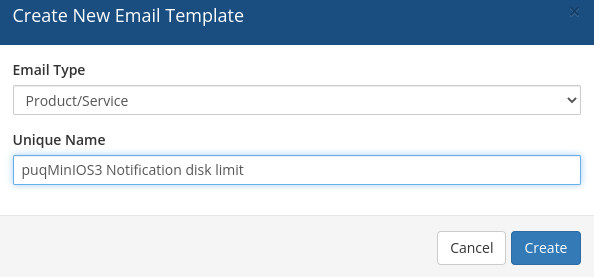
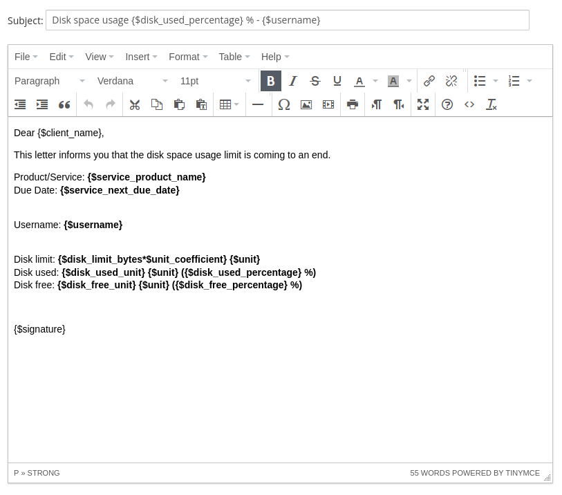

# Email Template (puqMinIOS3 Notification disk limit)

Create an email template for customer notifications when disk usage approaches the limit.

Navigate to: **System Settings → Email Templates → Create New Email Template**

---

## Template configuration

| Parameter | Value |
|-----------|-------|
| **Email Type** | Product/service |
| **Unique Name** | `puqMinIOS3 Notification disk limit` |

---

## Email Subject

```
Disk space usage {$disk_used_percentage} % - {$username}
```

---

## Email Body

```html
Dear {$client_name},

This letter informs you that the disk space usage limit is coming to an end.

Product/Service: {$service_product_name}
Due Date: {$service_next_due_date}

Username: {$username}

Disk limit: {$disk_limit_bytes*$unit_coefficient} {$unit}
Disk used: {$disk_used_unit} {$unit} ({$disk_used_percentage} %)
Disk free: {$disk_free_unit} {$unit} ({$disk_free_percentage} %)

{$signature}
```

---

## Available template variables

| Variable | Description |
|----------|-------------|
| `{$username}` | MinIO S3 account username |
| `{$disk_limit_bytes*$unit_coefficient}` | Total disk space limit |
| `{$disk_used_unit}` | Used disk space |
| `{$disk_free_unit}` | Free disk space |
| `{$disk_used_percentage}` | Used disk space percentage |
| `{$disk_free_percentage}` | Free disk space percentage |
| `{$unit}` | Disk space unit (MB, GB, TB, PB) |

> **Note:** Standard WHMCS merge fields are also available in this template.




