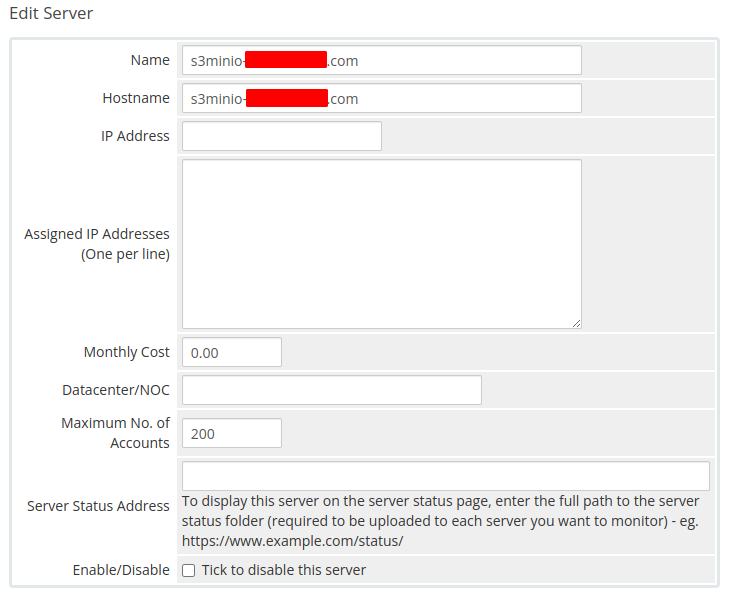
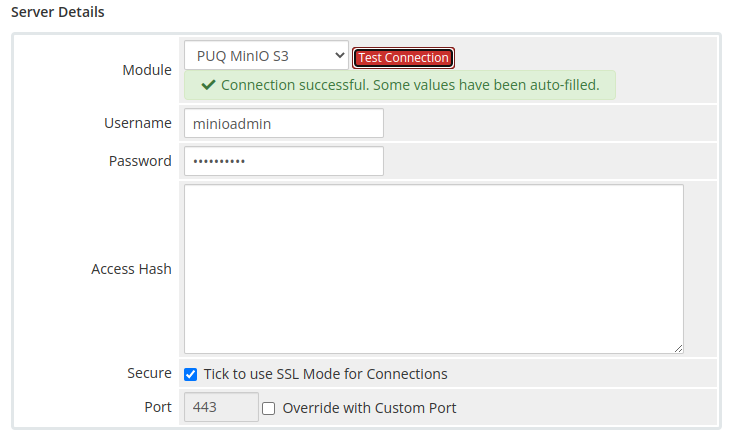

# Add server (MinIO S3)

## Add a new server to the system WHMCS

Navigate to: **System Settings → Servers → Add New Server**

---

## Step 1 — General settings

Enter the correct **Name** and **Hostname** for your MinIO S3 server.

---

## Step 2 — Module settings

In the **Server Details** section:

1. Select the **PUQ MinIO S3** module
2. Enter the correct **username** and **password** for the MinIO web interface
3. Click the **Test connection** button to verify the connection

> **Note:** The MinIO user must have administrator privileges to manage users, policies, and buckets via the API.
