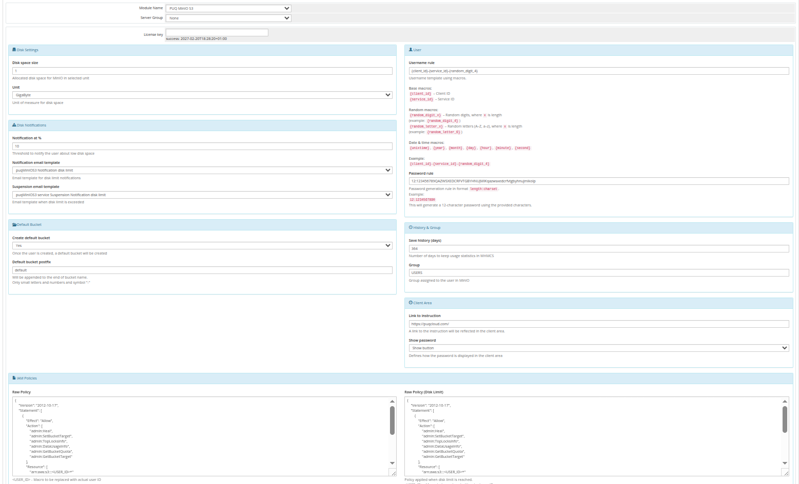

# Product Configuration

## Add new product to WHMCS

Navigate to: **System Settings → Products/Services → Create a New Product**

In the **Module Settings** section, select the **PUQ MinIO S3** module.

---

## Configuration parameters

| Parameter | Description |
|-----------|-------------|
| **License key** | A pre-purchased license key for the PUQ MinIO S3 module. For the module to work correctly, the key must be active |
| **Unit** | Packet disk space units (MB, GB, TB, PB) |
| **Disk space size** | Disk size in this product (set to 0 for unlimited) |
| **Notification disk limit email template** | Email template that will be sent when the disk quota is exceeded in % |
| **Notification, used disk space X %** | Sets a percentage parameter (1-100, default 90), after exceeding this parameter a notification will be sent to the user |
| **Group** | The group that will be assigned to the user on the server side of the MinIO S3 |
| **Raw Policy** | The policy that is assigned to the user during creation on the server |
| **Suspend exceeding disk limit email template** | The template of the letter that will be sent to the client if his disk limit is 100% or less 100% |
| **Raw policy Disk limit** | The policy that will be applied to the client when the client runs out of space |
| **Save usage history (days)** | The number of days it takes to save user disk usage statistics |
| **Link to instruction** | Link to the instruction, if filled out, it will be reflected in the client area |
| **Default Bucket** | Options to enable or disable the creation of a default bucket, and also set its prefix |
| **Client Area** | Client zone settings — show or not show the password in the client zone, type how to show the password |

---

## Username rule

Default: `{client_id}-{service_id}`

| Macro | Description |
|-------|-------------|
| `{client_id}` | Client ID |
| `{service_id}` | Service ID |
| `{unixtime}` | Current Unix timestamp |
| `{date}` | Current date (YYYY-MM-DD) |
| `{time}` | Current time (HH-MM-SS) |
| `{random_digit_x}` | Random digit string of length x |
| `{random_letter_x}` | Random letter string of length x |

---

## Password rule

Default: `12:123456789QAZWSXEDCRFVTGBYHNUJMIKqazwsxedcrfvtgbyhnujmikolp`

Format: `length:charset` — where length is the password length and charset is the set of characters to use.

---

## Raw Policy (Standard)

The policy that is assigned to the user during creation on the server:

```json
{
    "Version": "2012-10-17",
    "Statement": [
        {
            "Effect": "Allow",
            "Action": [
                "admin:Heal",
                "admin:SetBucketTarget",
                "admin:TopLocksInfo",
                "admin:DataUsageInfo",
                "admin:GetBucketQuota",
                "admin:GetBucketTarget"
            ],
            "Resource": [
                "arn:aws:s3:::<USER_ID>*"
            ]
        },
        {
            "Effect": "Allow",
            "Action": [
                "s3:*"
            ],
            "Resource": [
                "arn:aws:s3:::<USER_ID>*"
            ]
        }
    ]
}
```

---

## Raw Policy Disk Limit

The policy that will be applied to the client when the client runs out of space:

```json
{
    "Version": "2012-10-17",
    "Statement": [
        {
            "Effect": "Allow",
            "Action": [
                "admin:Heal",
                "admin:SetBucketTarget",
                "admin:TopLocksInfo",
                "admin:DataUsageInfo",
                "admin:GetBucketQuota",
                "admin:GetBucketTarget"
            ],
            "Resource": [
                "arn:aws:s3:::<USER_ID>*"
            ]
        },
        {
            "Effect": "Allow",
            "Action": [
                "s3:GetObject",
                "s3:DeleteObject",
                "s3:ListBucket"
            ],
            "Resource": [
                "arn:aws:s3:::<USER_ID>*"
            ]
        }
    ]
}
```

> **Important:** Policy recalculation occurs once a day during the collection of server statistics (UpdateServerUsage).


