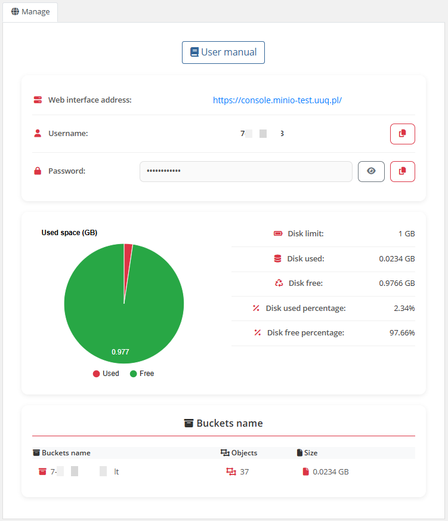

# Home screen

Screenshot when the account is in a normal state.

The end customer, after logging in to his own customer panel, has access to the following information and options:

- Link to the user manual (which was defined by the administrator when setting up the service)
- MinIO server address
- Authorization data (username and password with copy buttons)
- Usage statistics graph
- Table with data on the use of the service
- Bucket Information

