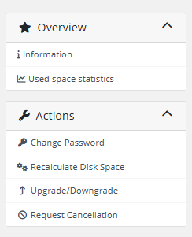
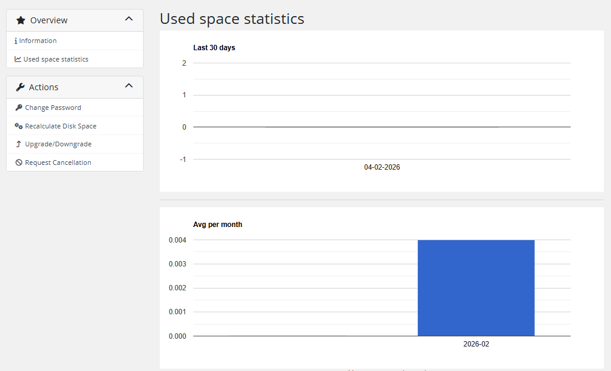

# Disk statistics

Client can check the data usage statistics in the menu item **Used space statistics**.

The statistics page displays disk usage data collected by the WHMCS cron and stored in the database:

- **Last 30 days chart** — daily disk usage displayed as a column chart
- **Average per month chart** — monthly average disk usage

Both charts are rendered using Google Charts.

