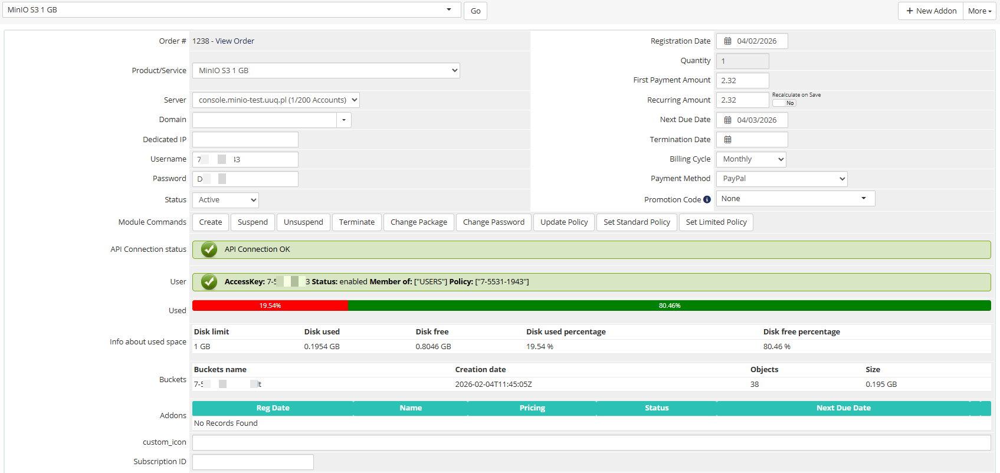

# Product Information

Here is the data presented for the service admin in WHMCS.

The admin area provides the following information and controls:

- **License verification status** — green/red indicator showing license validity
- **API connection status** — real-time test of the MinIO server connection
- **User information** — username, enabled status, group, and email
- **Disk usage** — visual progress bar with detailed usage table
- **Management actions** — Create, Suspend, Unsuspend, Terminate, Change Password, Change Package

## Policy management

- **Update Policy** button — force the system to select and apply the necessary policy. If there is more than 0 free space on the disk, a permissive policy will be applied; if there is 0 free space on the disk, a restrictive policy will be applied.
- **Set Standard Policy** and **Set Limited Policy** buttons — enforce the application of the standard policy and the limited policy respectively.

> **Important:** Policy recalculation occurs once a day during the collection of server statistics (UpdateServerUsage).

